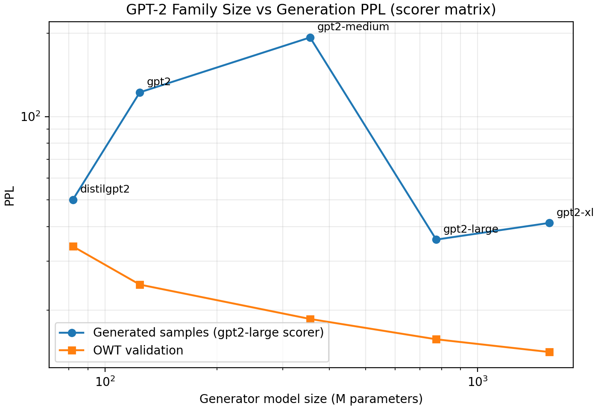
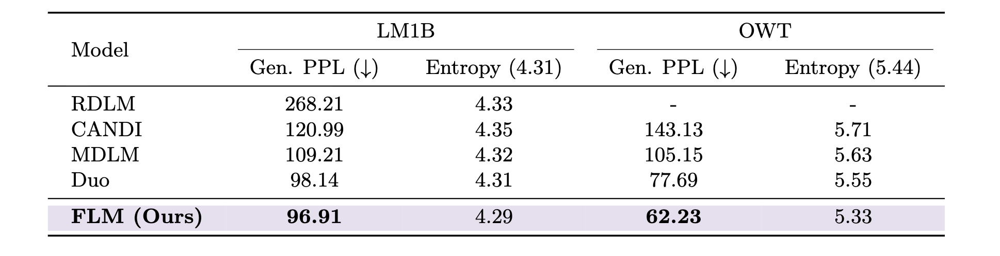
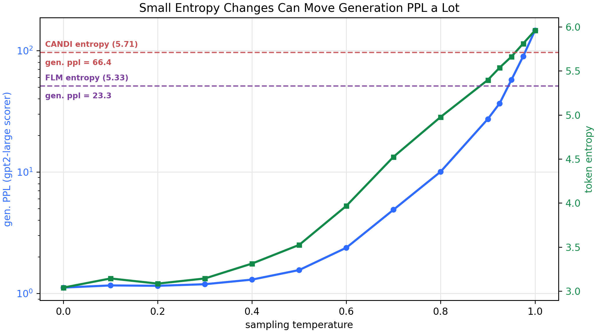
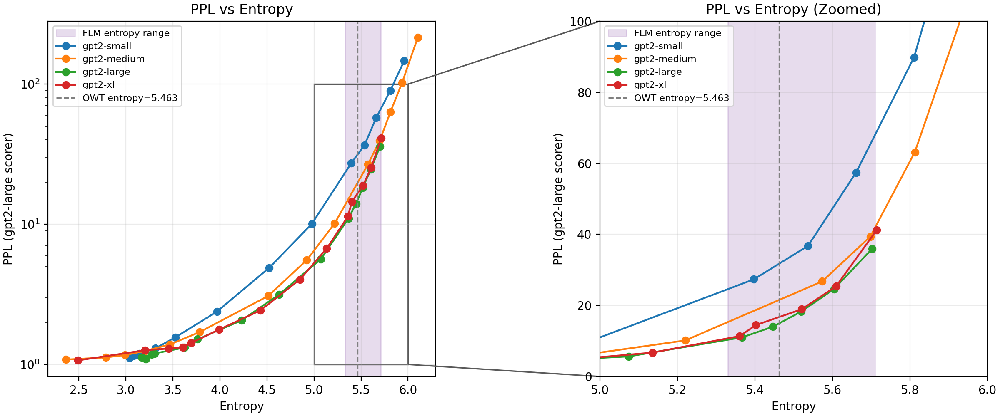
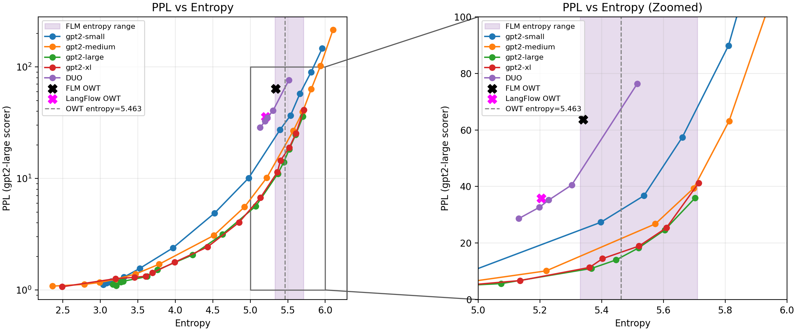
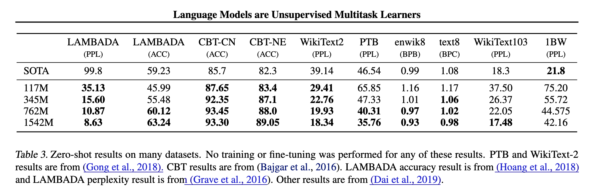
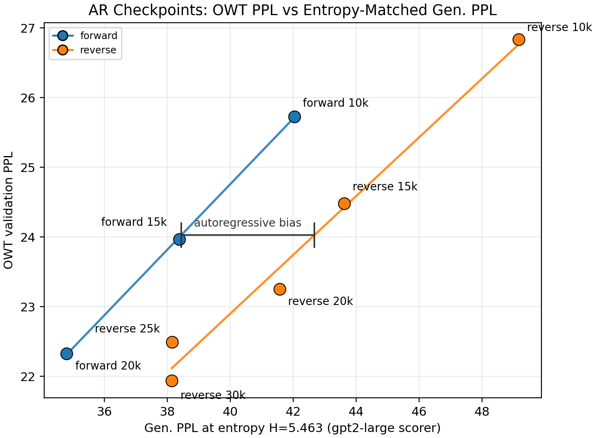
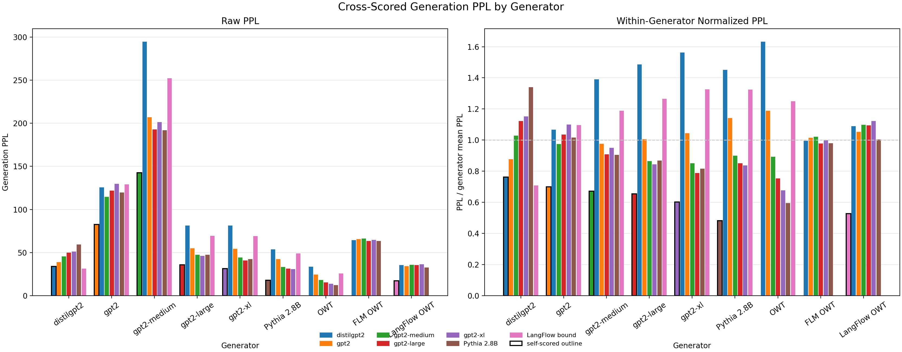

# Fixing flow model evals

Flow models are very promising. Yet, the current way of evaluating these models is ripe for misinterpretation and needs rethinking.

In the current flow evaluation framework, one would conclude that `gpt2-large` (762M) is better than `gpt2-xl` (1.5B), and `gpt2-small` (117M) is better than `gpt2-medium` (342M), despite the fact that all measured evaluations in the [GPT-2 paper](https://cdn.openai.com/better-language-models/language_models_are_unsupervised_multitask_learners.pdf) smoothly improve as we increase model size.

  

    <table>
      <thead>
        <tr>
          <th>model</th>
          <th style="text-align: right;">gen. ppl</th>
          <th style="text-align: right;">entropy (data=5.44)</th>
        </tr>
      </thead>
      <tbody>
        <tr>
          <td>gpt2</td>
          <td style="text-align: right;">122.3149</td>
          <td style="text-align: right;">5.8842</td>
        </tr>
        <tr>
          <td>gpt2-medium</td>
          <td style="text-align: right;">193.0853</td>
          <td style="text-align: right;">6.0724</td>
        </tr>
        <tr>
          <td>gpt2-large</td>
          <td style="text-align: right;">35.9183</td>
          <td style="text-align: right;">5.7023</td>
        </tr>
        <tr>
          <td>gpt2-xl</td>
          <td style="text-align: right;">41.2730</td>
          <td style="text-align: right;">5.7145</td>
        </tr>
      </tbody>
    </table>
  

  

    
  

The source of this difference is that exact sequence likelihood is intractable for flow models. For an autoregressive model, we can evaluate validation perplexity directly by computing $p_{\text{model}}(x_i \mid x_{<i})$ for each token in a held-out sequence. For flow models, where exact likelihood is intractible, papers often evaluate generated samples using two proxy metrics:

- **Generative perplexity (gen. ppl):** generate samples from the model, then score those samples under a pretrained autoregressive model such as `gpt2-large`.
- **Entropy:** compute the empirical token entropy ($-\sum_i p_i \log p_i$) of each generated sample, then average across samples.

However, as hinted above by the strange ordering of the gpt2 models, this evaluation framework can be problematic. Here, I'll present three issues which explain what went wrong, and I'll propose solutions (which the field is already converging towards) at the end. The issues:

1. It is trivial to generate "SOTA" results by trading off a little entropy for a lot of PPL
2. Entropy only measures intra-sample diversity: inter-sample diversity is an after thought
3. The best-scoring model is not the best language model, but the most `gpt2-large`-like

Importantly, flow map language models are unambiguously better at small step sizes: the issues pointed out here focus on larger step sizes (1024 steps) to help converge on better practices to improve future works, not to detract from past works. Unless otherwise noted, gen. ppl is scored using `gpt2-large`.

## The issues

### 1. It is trivial to generate "SOTA" results by trading off a little entropy for a lot of PPL

There is an inherent tradeoff to gen. ppl and entropy. I can easily construct a low gen. ppl sequence with very high entropy (e.g. "aaaaaa..." has gen. ppl = 1.01 and entropy = 0.0), or a high gen. ppl sequence with very low entropy (e.g. completely random tokens has gen. ppl ~= 150,000 and entropy = 6.92). Recent works often report gen. ppl and entropy, marking results that have incredibly low entropies as "mode collapsed". The variation in entropy between models is > 0.3 nats in all of three recent papers ([Flow Map Language Models](https://arxiv.org/pdf/2602.16813), [Discrete Flow Maps](https://arxiv.org/abs/2604.09784), [LangFlow](https://arxiv.org/pdf/2604.11748)). Below we show the results from [Flow Map Language Models](https://arxiv.org/pdf/2602.16813), a representative example.

From Flow Map Language Models.

From the main results for OWT, it is natural to read as "entropies are close to eachother, so the one with the lowest gen. ppl must be best": FLM > Duo > MDLM > CANDI. However, the gen. ppl of a given model is *incredibly* sensitive to the entropy, and this small variation makes a big difference.

We can easily quantify this sensitivity in autoregressive language models by sweeping over temperatures used to generate sequences: lower temperature generations create low entropy, low gen. ppl samples, and higher temperature generations create high entropy, high gen. ppl samples. Below, we sweep from `t=0` to `t=1` and report the gen. ppl and entropy at each temperature.

As you can see, a linear increase in entropy leads to an exponential increase in perplexity (note that PPL scale is logarithmic while entropy scale is linear).

This exponential sensitivity is expected because perplexity is the exponential of cross-entropy: PPL = exp(H(Q) + KL(Q || P)). Entropy alone does not determine PPL, but when the KL-to-scorer term changes smoothly, small linear changes in entropy translate into exponential changes in PPL.

Going from the lowest reported entropy (5.33) to the highest entropy (5.71) for *the same exact model* leads to a nearly 3x increase in PPL. In the reported results from FLM, the range in PPL is ~2.3x. So, at least in autoregressive models, **small changes in entropy can lead to huge changes in gen. ppl -- enough to completely inverse the "best" ordering of reported results**.

Now, can we use this insight (small changes in entropy lead to exponential changes in gen. ppl) to resolve the quandary from earlier (using gen. ppl as a metric, `gpt2-small` > `gpt2-medium` and `gpt2-xl` > `gpt2-large`)? **Yes (partially)!**

Both gen. ppl and entropy monotonically increase with temperature, so we can plot -- for each `gpt2` model -- gen. ppl v. entropy using the values of the previous sweep.

This reveals a pareto frontier of gen. ppl vs. entropy. Under this, `gpt2-medium` is clearly better than `gpt2-small`. If you look at the `t=1` point (the most far right) you can see what caused the earlier discrepancy: `gpt2-medium` generates higher entropy samples at `t=1`. Note that, by just changing the sampling temperature and using the flow model evaluation framework, you could conclude **any arbitrary ordering of the gpt2 family models**: each model's lowest gen. ppl in the entropy range is lower than any other model's max gen. ppl in the entropy range.

But, even after controlling for sample entropy, `gpt2-large` is slightly better than `gpt2-xl`. What gives? The answer is in section 3: the best-scoring model is not the best language model, but the most `gpt2-large`-like. If we swap the scorer from `gpt2-large` to `pythia-2.8b`, then at the data entropy, `gpt2-xl` > `gpt2-large` > `gpt2-medium` > `gpt2-small` as expected.

But does this hold for flow models and their reported baselines? After all, `gpt2` models are not compared against. Below, we plot the perplexity and entropy for FLM and LangFlow, and we sweep DUO (a baseline) from `t=0.9` to `t=1.0`.

As you can see, under `t=1` sampling (right-most point), DUO has a higher gen. ppl than both FLM and LangFlow, but it is better when entropy-matched.

#### Proposal

Fixing this is straightforward: sweep PPL and entropy. Report interpolated gen. PPL at the entropy of the data. This completely eliminates any variance attributable to difference in entropy.

### 2. Entropy only measures intra-sample diversity: inter-sample diversity is an after thought

In some recent flow model papers, entropy is referred to as a "diversity" measure. However, it is only measuring diversity *within* a sequence and *averaging* across sequences: $\mathrm{mean}(-\sum_i p_i \log p_i)$. This means that if a model generated the same low gen. ppl, high entropy sequence, under these two metrics it would seem like an incredibly strong model.

To give an example, if the model recited the following sequence from OWT every single sample, it's PPL would be 4.283 with an entropy of 5.42:

> Rice, 42, was the highest-ranking officer of the six police officers charged in Gray's arrest and death. Prosecutors had alleged that Rice and others caused Gray's death by failing to secure him in a seat belt in the back of the van, where Gray suffered severe spinal cord injuries last year.\n\nRice was suspended without pay from May 1, 2015, when he was charged by the state's attorney's office, until July 18 of this year, when Circuit Judge Barry Williams found Rice not guilty of all charges.\n\n\"Being suspended without pay for over a year has been financially devastating to Lt. Rice and his family,\" said Michael Belsky, Rice's attorney.\n\nWilliams said prosecutors failed to meet their burden of proving the charges against Rice beyond a reasonable doubt, instead asking the court to rely on \"presumptions or assumptions\" \u2014 something it cannot do. He said the court \"cannot be swayed by sympathy, prejudice or public opinion.\"\n\nCAPTION Baltimore State's Attorney Marilyn Mosby talks about why her team decided to drop the charges against the officers in the Freddie Gray case. (Kevin Richardson/Baltimore Sun video) Baltimore State's Attorney Marilyn Mosby talks about why her team decided to drop the charges against the officers in the Freddie Gray case. (Kevin Richardson/Baltimore Sun video) CAPTION \"I think most of the blame falls to the prosecutor who failed to prosecute the case and brought cases that she didn't have the evidence for,\" Gov. Larry Hogan said. (Erin Cox/Baltimore Sun video) \"I think most of the blame falls to the prosecutor who failed to prosecute the case and brought cases that she didn't have the evidence for,\" Gov. Larry Hogan said. (Erin Cox/Baltimore Sun video)\n\nMayor Stephanie Rawlings-Blake has said Rice now faces an administrative review.\n\nGray, 25, died April 19, 2015, one week after his arrest. His death sparked weeks of protests and activism against police brutality, and two nights of looting and rioting.\n\nLast month, the spending panel authorized $87,705 in back pay for Officer Caesar Goodson Jr., the driver of the van in which Gray sustained his injuries. He, too, was cleared of all charges at trial. Williams also acquitted Officer Edward Nero, and prosecutors dropped all charges against the other three police officers.\n\nLbroadwater@baltsun.com\n\nTwitter.com/lukebroadwater<|endoftext|>MIAMI, August 9 \u2013 The Miami HEAT announced their 2016-17 preseason schedule today, which is highlighted by the team\u2019s three home games at AmericanAirlines Arena. The HEAT will open the preseason on the road on Tuesday, October 4, when they take on the Washington Wizards at 7PM. They will make their first appearance in Miami a week later, when they host the Brooklyn Nets at 7:30PM on Tuesday, October 11. They will also face off with the Orlando Magic in Miami on October 18 at 7:30PM, and conclude the home preseason schedule vs. the Philadelphia 76ers on October 21 at 7:30PM.\n\nTickets for the three home games at AmericanAirlines Arena are on sale now and can be purchased by logging on to HEAT.com, Ticketmaster.com, by visiting any Ticketmaster outlet, or by calling 1-800-4NBA-TIX. Tickets can also be purchased at the AmericanAirlines Arena Ticket Office Monday through Friday from 10AM to 5PM. Ticket prices start at $10 plus applicable fees.\n\nIn addition to the three home games at AmericanAirlines Arena, the HEAT will host two neutral site games vs. the Minnesota Timberwolves. Miami returns to the Sprint Center in Kansas City, MO, for the sixth time on October 8. Tickets to that game are available by visiting SprintCenter.com, Price Chopper Box Office at Sprint Center or by calling (888) 929-7849. The HEAT will also return to the KFC Yum! Center in Louisville, KY, for the third straight season, on October 15. Tickets are available at the KFC Yum! Center Box Office, all Ticketmaster outlets, Ticketmaster.com or by calling (800) 745-3000. Miami will also play road contests against the San Antonio Spurs on October 14, and the Charlotte Hornets on October 21.\n\nThe complete broadcast schedule for the preseason will be released at a later date.\n\nThe preseason schedule is as follows:\n\nDATE OPPONENT LOCATION TIME TICKETS Oct. 4 at Washington Verizon Center, Washington, DC 7:00 PM Oct. 8 vs. Minnesota Sprint Center, Kansas City, MO 7:30 PM Oct. 11 vs. Brooklyn AmericanAirlines Arena, Miami, FL 7:30 PM Buy Tickets Oct. 14 at San Antonio AT&T Center, San Antonio, TX 7:30 PM Oct. 15 vs. Minnesota KFC Yum! Center,

Obviously, this is very unlikely to occur in any reasonable setup. The point is that **entropy is not measuring diversity of samples at all**, only diversity within a sample.

The field is aware of this. In [Flow Map Language Models](https://arxiv.org/pdf/2602.16813), they report self-BLEU scores (geometric average of ngram overlap) in the appendix to check for "mode collapse". This is very useful but now interpretation of results relies on 3 variables: gen. ppl, per-sample entropy, and self-BLEU, which makes it hard to tell when a new method is an improvement or just trading off diversity for quality.

#### Proposal

Report self-BLEU as in Flow Language Models. This is not perfect, but it does act as a crude measure of diversity.

### 3. The best-scoring model is not the best language model, but the most `gpt2-large`-like

`gpt2-large` is an imperfect model of language. Even just comparing to `gpt2-xl`, it has lower accuracy and higher PPL in-distribution on OWT and out-of-distribution on every measured benchmark.

However, as shown earlier, `gpt2-large` gives a better gen. ppl to its own samples than to `gpt2-xl` samples. In fact, `gpt2-large` assigns a higher probability to its own samples than to actual samples of the data (when matching entropy=5.463). This is unsurprising: by definition, the highest probability (lowest gen. PPL) strings are those greedily (`t=0`) generated by the scoring model. 

You can also dream up many clear examples to show that the current evaluation is penalizing "correct" behavior: when scoring completions of `10753 * 1099 = ` (just a random multiplication problem, given with 50 in-context examples), `gpt2-large` gives a PPL of [BLANK] to the correct answer (`11_817_547`) but a PPL of [BLANK] to the answer [BLANK]. **gen. ppl is not scoring which model matches the data better, but rather it is scoring which model matches (imperfect) `gpt2-large` better.**

Further, this means that the eval is architecturally biased towards left-to-right autoregressive models. As a way to see this, we trained 2 models: one left-to-right AR model on OWT, and one right-to-left AR model on OWT. We find two checkpoints that have ~the same validation perplexity. Because left-to-right AR is fundamentally easier, this is ~25k steps for right-to-left and ~20k steps for left-to-right. Then, we can plot the entropy v. temperature curve, and note that the right-to-left model is worse compared to the equivalent (by validation ppl) left-to-right model.

#### Proposal

Fixing this is not straightforward: it is inherent to the idea of using another model as the ground truth. But, if we are going to treat a language model as the ground truth language distribution, we might as well use the better one: `gpt2-xl`.

## The fixes

As mentioned throughout, there are many ways to easily improve these evals, and the field is already working towards them. As mentioned earlier, [Flow Map Language Models](https://arxiv.org/pdf/2602.16813) reports self-BLEU scores, [LangFlow](https://arxiv.org/pdf/2604.11748) reports PPL bounds on actual validation data. Here, we give a few concrete ideas which address the earlier outlined issues.

### Small changes: report entropy-matched gen. ppl, self-BLEU, and use `gpt2-xl` as the scorer

As mentioned at the end of each section, the three problems can be ameliorated through small changes.

As we showed, you can dramatically change the PPL of a model by reducing its entropy a small amount. To make interpreting results easily, we should report gen. ppl *at the entropy of the data*. This avoids any variance between methods attributable to difference in entropy.

Additionally, we showed that gen. ppl and entropy do not measure inter-sample diversity at all. To address this, as in [Flow Map Language Models](https://arxiv.org/pdf/2602.16813), report self-BLEU scores.

Finally, we showed that using any model as a scorer means that it gives higher scores to models which make the same mistakes. And since we do not have access to the true data generating distribution of language, we must settle for an imperfect scorer. With this being the case, we might as well use the *better* drop-in replacement model of language: `gpt2-xl` instead of `gpt2-large`.

### Larger changes: Report PPL bounds and focus on downstream metrics

The changes above are patching an imperfect framework. I think a bigger improvement is to report PPL bounds on actual data (as in [LangFlow](https://arxiv.org/pdf/2604.11748)) and to focus on downstream metrics (like Sudoku in [Flow Map Language Models](https://arxiv.org/pdf/2602.16813)). Calculating PPL bounds on real data sidesteps all of the outlined problems. One issue is that calculating this PPL bound is quite slow, the gap between the bound and the true PPL is unknown, and also new models must derive their own PPL bounds. Work in this area (faster, more general, tighter bounds) is great.

Furthermore, why do we care about PPL in the first place? On one hand, it is very natural: it is a function of the probability of sequences under the model, it gives ~number of tokens that the model is guessing between with equal probability. On the other hand, we want these models to *do* useful things: solve our problems, answer questions. So, by focusing on these downstream metrics which only require drawing samples, we can go beyond this gen. ppl fixation.

## Open questions

In writing this up, there are a few things I couldn't get a satisfying answer to.

### 1. Why are flow model gen. ppl scorers largely independent of the scorer

If we run generate tokens with a list of models and score them with every model, we get the plot below (left). Note that this confounds sample entropy and does not control for the problem above.

As you can see, there is lots of variance across the scorers for a given generator for all but 3 models: `gpt2`, `FLM`, and `LangFlow`.

Why is this? I ran per-token scoring and for these models, it isn't that there is more agreement per token (lower variance), but rather that the disagreement is there (high variance) but it seems to cancel out when averaged across tokens. I don't have an intuitive explanation for why this is or what it means.

### 2. What is the best way to tradeoff entropy v. ppl in flow models?

In autoregressive models and (some) masked diffusion models, it is trivial to tradeoff entropy and gen. ppl: just change the temperature. However, in a flow model, I'm not sure what the relevant lever to pull is.
